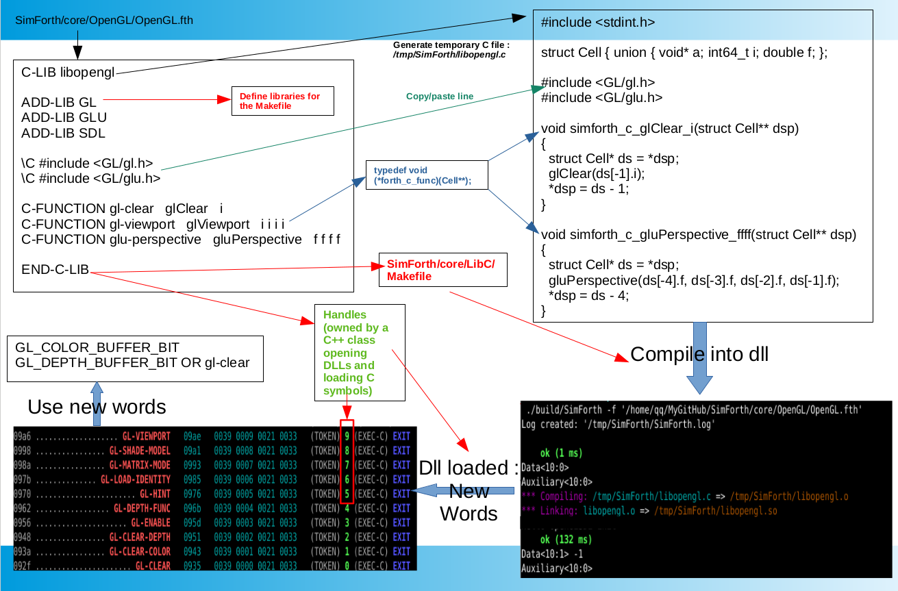

# Linking C code to SimForth

Sometimes, you do not want to reinvent the wheel by coding in Forth some already
existing C libraries or some of them are too huge (like GTK+,
OpenGL ...). SimForth allows you to be linked to external C libraries and create
Forth words calling functions.

The following picture summarizes the process:



This document will explain it.

## Basic Example

Let suppose you want to load some functions from OpenGL. The following SimForth
code is a partial extract from [core/OpenGL/OpenGL.fth](../core/OpenGL/OpenGL.fth).
While not functional "as it", it will show you how to create automatically associated Forth words.

```
C-LIB libopengl

ADD-LIB GL
ADD-LIB GLU
ADD-LIB SDL

\C #include <GL/gl.h>
\C #include <GL/glu.h>

C-FUNCTION gl-viewport   glViewport   i i i i
C-FUNCTION sdl-set-video-mode   SDL_SetVideoMode   i i i i -- a
END-C-LIB
```

Before explaining this code and SimForth internals let run this script. SimForth
will prompt the following message (that may differ from you):

```
*** Compiling: /tmp/SimForth/libopengl.c => /tmp/SimForth/libopengl.o
*** Linking: libopengl.o => /tmp/SimForth/libopengl.so
```

In case of compilation error, error messages are displayed.

Now when typing `words` or `see` you will see them:

```
092f ...................... GL-CLEAR   0935   0039 0000 0021 0033   (TOKEN) 0 (EXEC-C) EXIT
093a ................... GL-VIEWPORT   0942   0039 0001 0021 0033   (TOKEN) 1 (EXEC-C) EXIT
0947 ............... GLU-PERSPECTIVE   0951   0039 0002 0021 0033   (TOKEN) 2 (EXEC-C) EXIT
```

## Generation of the temporary C file

- The line `C-LIB libopengl` will create an empty temporary c file
  `/tmp/SimForth/libopengl.c`.

- Lines starting with `ADD-LIB` will add some parameters to the Makefile. We
  will explain it soon.

- Lines starting with `\C` will insert in the file a line of code.

- Lines starting with `C-FUNCTION` will add in the file a C function wrapping
  the real function and pushing/poping parameters from/to SimForth data stack.
  Parameters are: name of the Forth word, name of the C function, list of input
  parameters, list of output parameters. Ie

- `END-C-LIB` close the temporary file, call the Makefile to compile it into a
  shared library, load it into SimForth and create Forth words.

Let see what the `/tmp/SimForth/libopengl.c` contains. The contain may differs
from you but the idea stay the same:

``` c++
#include <stdint.h>

struct Cell { union { void* a; int64_t i; double f; }; enum { INT = 0, FLOAT } tag; };

#include <GL/gl.h>
#include <GL/glu.h>

void simforth_c_glViewport_iiii(struct Cell** dsp)
{
  struct Cell* ds = *dsp;
  glViewport(ds[-4].i, ds[-3].i, ds[-2].i, ds[-1].i);
  *dsp = ds - 4;
}

void simforth_c_SDL_SetVideoMode_iiii_a(struct Cell** dsp)
{
  struct Cell* ds = *dsp;
  ds[-4].a = SDL_SetVideoMode(ds[-4].i, ds[-3].i, ds[-2].i, ds[-1].i);
  ds[-4].tag = INT;
  *dsp = ds - 3;
}
```

We see:
- `#include` added by `\C`.

- `struct Cell { ...` which is a reminder of the structure of SimForth data
satck.

- All wrapped function have the same definition: taking a single parameter the
  address of the SimForth data stack and returning void. For example `void
  simforth_c_glViewport_iiii(struct Cell** dsp)` has been construct from the
  prefix `simforth_c_` plus `glViewport` which is the second parameter of
  `C-FUNCTION` and `_iiii` which means 4 input parameters of type integer (which
  is the concatenation of given parameter of `C-FUNCTION`). This function does
  not have output parameters.

- The content of each wrapped function is the same for all: input parameters are
  poped from the data stack of SimForth, then the real function is called and
  its output values is pushed on the data stack. Finally the depth of the stack
  is updated. Checks for stack underflow is made from SimForth not inside this
  function.

## Compilation of the temporary C file

This file is compiled into a shared library thansk to the Makefile located in
`/usr/share/SimForth/0.2/core/LibC/Makefile` (if and only if you have installed
SimForth on your operating system). Forth words gives extra information to the
Makefile:
- `ADD-LIB` to indicate the library name (the `-l` will be added).
- `PKG-CONFIG` to indicate the library name to pkg-config (a helper tool finding
  libraries and their dependencies).

## Loading Symbols

Once the shared library has been compiled, SimForth uses function such as
`dlopen` to extract symbols (functions). These symbols are stored internally in
SimForth in a lookup table. A new Forth word is then created in the dictionary
looking at the function and calling it. For example the `GL-CLEAR` will call the
following primitives: `(TOKEN) 0 (EXEC-C) EXIT` The symbol `0` unique identifier
of the symbol will be pushed on the data satck and the `(EXEC-C)` will execute
the associated function.
