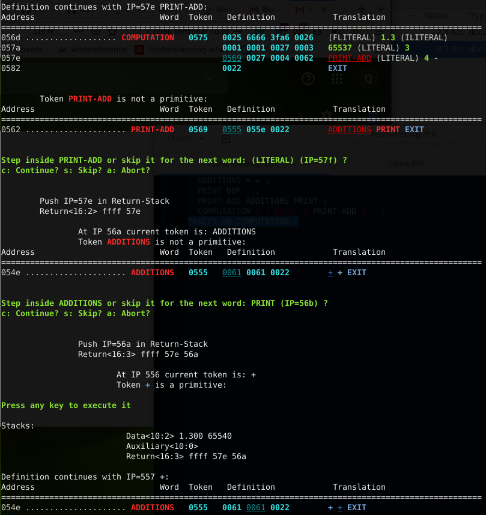

# SimForth

## SimForth file extension convention

SimForth files are pure ASCII files. You can use the extension you desired:
`.fth`, `.fs`, `.f` ... Personally, I do not use the file extension `.fs` because
it can be confused with OpenGL fragment shader files.

## Understand the dictionary

This part is reserved for people with good knowledge in binary and who know how
standard Forth (78, 79) dictionary works. This section can be ignored for
beginners.

### Dictionary Dump

Let try to dump a Forth dictionary. In a Unix console type:

```sh
./build/SimForth -s dico
Dictionary successfully dumped in file 'dico'
```

A new binary file has been created. Let look at it. The whole file is not shown
here. Your content may differ but the idea stays the same. Note: In the case,
you do not have the command `hexdump` you can type instead `xxd dico`.

```sh
hexdump -C dico

00000000  83 4e 4f 50 00 00 00 00  00 00 83 42 59 45 00 00  |.NOP.......BYE..|
00000010  05 00 01 00 89 54 52 41  43 45 53 2e 4f 4e 00 00  |.....TRACES.ON..|
...
```

On the left `00000000 00000010` are addresses displayed in
hexadecimal. On the middle, `84 4e 4f 50 00 00 00 00 00 00 84 42 59 45 00 00` is
the content of the dictionary also displayed in hexadecimal. On the right
`|.NOP.......BYE..|` is the ASCII version of the dictionary.

Let analyse it the first line: `83 4e 4f 50 00 00 00 00 00 00`
* the first byte is `83` SimForth such as Forth 78 start each word entry by the
  flag `80` used for delimiting entries. Two flags can also be set (but not here: immediate and smudge bits). The `3` of `83` is the number of characters of the word `NOP` (meaning No OPeration).
* the 4 next bytes `4e 4f 50 00` encodes the C string "NOP" ending with '\0' byte for compatibility with char* and printf.
* the 5th byte is `00` to align the number of bytes to a number of dictionaries
  tokens (uint16_t).
* Next token `00 00` is the content of the LFA (Link Field Address) a relative address to the
  previous word. In this case, we are at the beginning of the dictionary there is no previous word and therefore the relative address to the previous word is 0.
* Next token `00 00` is the CF (Code Field) of the word. In this case the
  word is primitive because the value of the CF is less than the C++ parameter
  `Primitives::MAX_PRIMITIVES_` and therefore means the 1st primitive. The word definition ends here.

Let see the second Forth entry: `83 42 59 45 00 00 05 00 01 00`
* `83` meaning a new word entry with 3 characters.
* `42 59 45 00` codding for the C-string "BYE".
* `00` for the padding.
* `05 00` for the LFA referring to Name Field Address (NFA) of the previous word
  `NOP`. The relative address is `5` (be careful with endianess).
* `01 00` meaning the 2nd primitive.

We saw primitive words. Now let see secondary words. Let compile a new word:

```sh
./build/SimForth -e ": FOOBAR + + . ; IMMEDIATE" -s dico
   ok
Dictionary successfully dumped in file 'dico'
hexdump -C dico

...                                                         |...........(EXEC
000001c0  xx xx xx xx xx xx xx xx  c6 46 4f 4f 42 41 52 00  |-C)...)..FOOBAR.|
000001d0  07 00 ea 00 1d 00 1d 00  21 00 0a 00 e4 00        |........!.....|
```

The latest entry is stored at the address 01c8: `c7 46 4f 4f 42 41 52 00 07 00 ea
00 1d 00 1d 00 21 00 0a 00`. Let analyze it:
* `c6` means `86` with the immediate bit set (where `80` means a new entry
  and `6` the number of characters in the name).
* `46 4f 4f 42 41 52 00` is the C null-string "FOOBAR".
* `07 00` is the relative address to the previous word `(EXEC-C)`.
* `00 ea` is the Code Field and because this value is greater than
  `Primitives::MAX_PRIMITIVES_` this means this word is a secondary word.
* Note: Code Field value is the address where it is stored.
* `1d 00 1d 00 21 00 0a 00` is the definition of the word: `1d 00` refers to the
  forth primitive `+` (addition) and `21 00` means the Forth primitive `.`
  (print the top of the data stack), `0a 00` means the Forth primitive `EXIT`
  leaving the definition of a secondary Forth word.

Note:
* The last token `e4 00` does not belong to the definition of `FOOBAR` and is
  not stored inside the dictionary. It refers to set the word `LATEST` and is
  only saved inside the binary file. It is used during the loading of the file
  for setting the SimForth word `LAST` and `HERE` will smash it.

### Dictionary Pretty Print

This way of debugging the dictionary is fastidious. The `-d` option (or the word
`WORDS`) is here to help you (for this tutorial the dictionary is not fully
displayed and markdown does not show colors). Here is a screenshot of what you
can obtain (the image may be slightly different from your output).


Let explain this picture with a basic example:

```sh
./build/SimForth -e ": FOOBAR + + . ; IMMEDIATE" -d

Address                         Word  Token  Definition              Translation
============================================================================================
00e4 ........................ FOOBAR  00ea   001d 001d 0021 000a     + + . EXIT
...
009f ............................. +  001d   primitive
...
0000 ........................... NOP  0000   primitive
```

Let analyse this display, bottom to top:
* Address and token are always displayed in hexadecimal.
* `0000 ... NOP 0000 primitive` means the Forth word `NOP` is a primitive with
the Code Field (token) `0` stored at the index `0` in the dictionary.
* `00e4 ... FOOBAR 00ea 001d 001d 0021 000a + + . EXIT` means the entry of the
secondary word named `FOOBAR` starts at address `00e4`, its definition starts at
`00ea + 0001` and is made of tokens `1d 1d 21 0a` referring to words `+ +
. EXIT`.
* **Important note**: contrary to `hexdump` addresses are not displayed as bytes
  but as tokens (= 2 bytes). As proof `00e4 * 0002` gives `01c8` and we can see
  in `hexdump` the flags byte `c7` for `FOOBAR` starts at `01c8`.
* LFA are not displayed because this information is not important.

### Display of variables

When you use words such as `CREATE` (ie used in the definition of `VARIABLE`) data are stored after `EXIT`.
They are displayed as int16. For example:

```
VARIABLE SEIZE
16 SEIZE !
```

Will display:
```
Address                         Name  Token   Definition (Tokens)   Definition (Words)
====================================================================================================
07ba ......................... SEIZE   07bf   0033 002b 0010 0000   (CREATE) EXIT 16 0
07c4                                          0000 0000             0 0
```

### Decompile word

The word `SEE <name>` is similar to `WORDS` but only show the definition of the word `<name>`.

#### Dictionary Colors convention

* blue: primitives
* yellow: immediate primitives
* red: secondary words
* orange: immediate secondary words
* green: literals (integer or float)
* cyan: tokens.
* grey: hidden words.

Inspired by Moore's colorforth:
* http://www.profibing.de/colorforth/display.html
* http://www.figuk.plus.com/articles/chuck.pdf

## Debugger

How to debug a Forth definition ? Simply start the debugger with the word
`TRACES.ON` (and `TRACES.OFF` to halt it).  It is quite similar to the
dictionary display but only for the definition currently in execution. Here a
screenshot of what you can obtain (the image may be slightly different from your
output):



Let explain this picture! The debugger shows the definition of the word
currently in execution in the same way as explained in the previous section
concerning the dictionary: addresses of the dictionary, tokens (byte codes) and
the human-readable format of tokens. Note that, contrary to the display of the
dictionary, a token and a word are underlined. This is for indicating the
position of the Interpretation Pointer (IP): the internal pointer of the word
currently in execution.

For each secondary word (non-primitive word) the debugger offers you either to
enter this definition or to skip it. When entering to the child word, the IP is
stored in the Return-Stack which is displayed. When executing a primitive word
the debugger halts to give you time to analyse the Data-Stack (aka parameters
stack). Stacks are for the moment read only so you cannot manipulate them.

Tokens and address are always displayed in hexadecimal.

## Hidden words and Modules

### Hidden words

Hidden words are words stored in the dictionary but tagged with the smudge bit
(Forth-78). They are ignored during a dictionary search (ie `FIND`). By
"ignored" we mean that the dictionary still knows them (their LFA is still
linked to the previous word entry and their NFA is known from the next word
entry) but their execution token cannot be used in the definition of a new
secondary word. You still can print them (ie. with words such as `WORDS` or
`SEE`) they are rendered in grey. Nevertheless, words that already include them
in their definition will keep working. Consider this behavior as a way to
privatize word from the usage of an user. Example:

```
: FOO + + ;
: BAR FOO . ;
HIDE FOO       \ FOO is now hidden
SEE FOO        \ Displayed in grey
SEE BAR        \ Token FOO is displayed in grey
1 2 3 FOO .    \ [ERROR] Unknown word FOO
: FOOBAR FOO ; \ [ERROR] Unknown word FOO
1 2 3 BAR      \ ok 6
```

### Modules

Inspired by [this article](http://www.forth.org/fd/FD-V02N5.pdf) starting on
page 14, (132 as printed), you can really make private words and contrary to
hidden words, their LFA are modified and the dictionary no longer knows
them. When displayed in the dictionary, you will see them as literals not as
byte-code. For example without module:

```
: FOO + + ;
: BAR FOO . ;
WORDS
```

will display:
```
Address                         Name  Token   Definition (Tokens)   Definition (Words)
====================================================================================================
07b2 ........................... BAR   07b6   07ae 0015 002b        FOO . EXIT
07aa ........................... FOO   07ae   0070 0070 002b        + + EXIT
07a3 .................... other word   ....
```

But within module:

```
INTERNAL:
  : FOO + + ;
EXTERNAL:
  : BAR FOO . ;
MODULE
```

`FOO` is private and unknown from the dictionary:
```
Address                         Name  Token   Definition (Tokens)   Definition (Words)
====================================================================================================
07b2 ........................... BAR   07b6   07ae 0015 002b        07ae . EXIT
07a3 .................... other word   ....   xxxx xxxx 002b 4683   XXX XXX EXIT 18051
07ab                                          4f4f 0000 0007 07ae   20303 0 7 1966
07af                                          0070 0070 002b        112 112 43
```

`FOO` is no longer displayed and its name inside `BAR` definition has not been
found and its token `07ae` is displayed instead of the name. Finally, `FOO`
definition is still present inside the dictionary and the byte-code is displayed
as `4683 4f4f 0000 0007 07ae 0070 0070 002b`. Remember that `83` is flags and
name size and `464f4f0000` means `FOO`. These tokens follow the definition of
the previous word entry and the reason has been explained in the previous
section "Display Variables".

## Call C functions

C functions can be written, compile and linked against SimForth. I followed the gforth methodology.
Current limitation: a single library can be build (WIP).
Example:

```
C-LIB libhello
\C #include <stdio.h>
\C
\C void hello() { printf("Hello no input no output\n"); }
C-FUNCTION HELLO hello
END-C-LIB
```

You can use your new word `HELLO`.

With arameters:

```
C-LIB libhello
\C #include <stdio.h>
\C
\C float hello(float a, int b) { printf("Hello: %f+%d\n", a, b); return a + b; }
C-FUNCTION HELLO hello f i -- f
END-C-LIB
```

You can use your new word `42.2 66 HELLO`.
