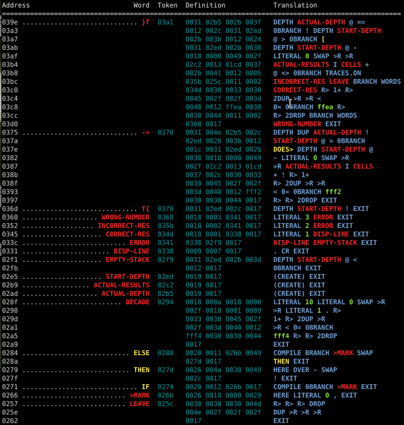
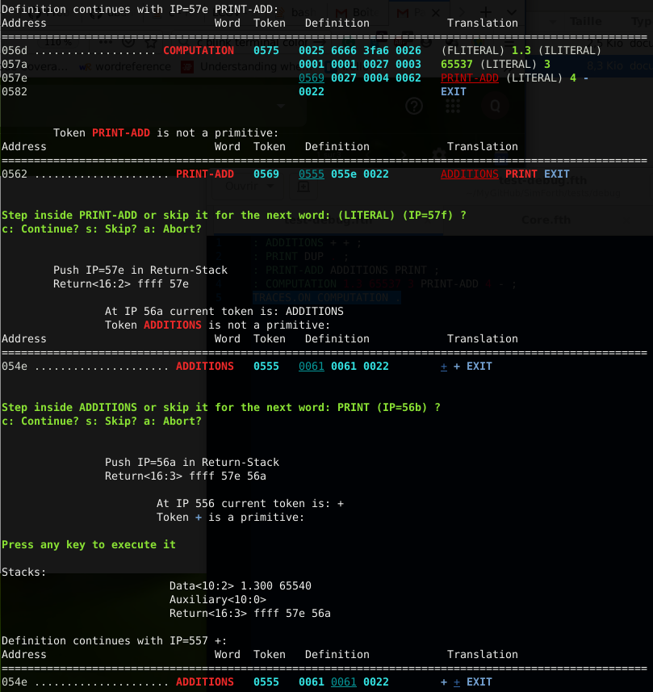

# SimForth Standalone

SimForth is a Forth-like scripting language used for the
[SimTaDyn](https://github.com/Lecrapouille/SimTaDyn) project. Nevertheless
SimForth can be compiled as : -- a standalone Forth interpreter in the same way
than gforth, pforth -- and a shared library to be embedded in your C/C++ project
if you desire to have a Reverse Polish Notation script language.

By "Forth-like" we mean that SimForth is not 100% compliant to ANSI-Forth
(2012).

## Compile SimForth
### Prerequisite

* Makefile, g++ >= 4.9 or clang++.
* Libraries: `sudo apt-get install libreadline-dev pkg-config bc`
* MyMakefile repo https://github.com/Lecrapouille/MyMakefile (used as git sub-module).
* The third part project https://github.com/bombela/backward-cpp downloaded
  automatically when you compile SimForth in debug mode.
* Optionally, if you want to run unit tests: Google tests (gtest and gmock), gcov
  (code coverage).

### Compilation commands

To download the source

```sh
git clone git@github.com:Lecrapouille/SimForth.git --depth=1 --recurse-submodules
cd SimForth
make download-external-libs
```

To compile the standalone SimForth binary:

```sh
cd SimForth
make
./build/SimForth
sudo make install
```

Compile libsimforth static and shared libraries:

```sh
cd SimForth
mv make make-bin
mv make-lib make
make
sudo make install
```
**FIXME: WIP the makefile-lib shall be used!**

Optionally, compile unit tests, run tests and display code coverage (for developers only):
```sh
cd SimForth
make check
```

Or simply :
```sh
cd SimForth/tests
make
./build/SimForth-UnitTests
```

## SimForth Standalone Usage

```sh
cd SimForth
./build/SimForth -h

Usage:   ./build/SimForth [-option] [argument]
option:  -h              Show this usage
         -u              Show this usage
         -l dico         Load a SimForth dictionary file and smash the current dictionary
         -a dico         load a SimForth dictionary file and append to the current dictionary
         -s dico         Dump the current dictionary into a binary file
         -f file         Interprete a SimForth script file (ascii)
         -e string       Interprete a SimForth script string (ascii)
         -d              Pretty print the dictionary with or without color (depending on option -x)
         -p path         Append new pathes to look for file. Pathes are separated by character ':'
         -r path         Replace pathes to look for file. Pathes are separated by character ':'
         -i              Interactive mode. Type BYE to leave
         -x              Do not use color when displaying dictionary
```

More explanations on arguments (which can be combined):
* SimForth can interpret a script Forth passed either as a file (-f) or as a command line (-e).
* SimForth has an interactive mode (-i). Type `BYE` or `bye` to leave.
* In SimTaDyn, the SimForth editor is a GUI made in GTK+ but this not yet the case for this repo.
* SimForth dictionary can be displayed on the console with colors (-d) This is inspired by Charles Moore's ColorForth.
* A dictionary file is a binary file containing the "dump" of the Forth dictionary (-s).
* Dictionaries can be loaded (-l) or concatenated to an existing one (-a).

### Basic Example

```sh
./build/SimForth -e "1 2 + ."
```

Execute a simple addition and show its result on the console.

### Complex Example

```sh
./build/SimForth -f core/Tester.fth -e "T{ 1 2 3 -> 1 2 3 }T" -p
```

`-f core/tester.fth` loads a file allowing to unit test the system; `-e "T{ 1 2
3 -> 1 2 3 }T"` execute a unit test checking if storing 3 numbers on the data
stack and calling no functions undamaged the data stack.  Finally `-p` display
the dictionary (modern display of the word `WORDS`).

## Use SimForth as library

You can easily embed a Forth interpreter in your C/C++ project and interact with
it. This kind of script can replace Lua. This basic example
https://github.com/Lecrapouille/LinkAgainstMyLibs/blob/master/Forth/src/main.cpp
shows you how your C++ code interacts with SimForth. To link SimForth against
your application you should use the `pkg-config` tool: `pkg-config --cflags
simforth` (compile flags) and `pkg-config --libs simforth` (linker flags).

## SimForth file extension convention

SimForth files are pure ASCII files. You can use the extension you desired:
`.fth`, `.fs`, `.f` ... Personally, I do not use the file extension `.fs` because
it can be confused with OpenGL fragment shader files.

## Installed files

I you have typed `sudo make install` you will see in folders:
* `/usr/bin` the binary SimForth.
* `/usr/share/SimForth/<version>/` documentations and core SimForth files.
* `/usr/lib` and `/usr/lib/pkgconfig` library files and pkg-config file.
* `/usr/include/SimForth-<version>/` header files for libraries.

SimForth already knows the path `/usr/share/SimForth/<version>/core` but if you
want to add extra folders in which to search your files, you have to use the
option `-p path1:path2:...`. To replace the path use the option `-r
path1:path2:...`. The `:` is used for separting folders in the same way than the
Unix environment variable `$PATH` (the order of search is given by the order of
folders).

For example: `-p "/home/Me/scripts/core:/home/Me/more/scripts/" will
give `'.:/home/xxx/MyGitHub/SimForth/core:/usr/share/SimForth/0.1/data/core:/home/Me/scripts/core:/home/Me/more/scripts`
while `-r "/home/Me/scripts/core:/home/Me/more/scripts/" for replacing will give
`'.:/home/Me/scripts/core:/home/Me/more/scripts`.

Example:
```sh
ls /home/Me/scripts/
f1.fth f2.fth

./build/SimForth -p "/home/Me/scripts/" -f f1.fth -f f2.fth
```

**Work In Progress:** An environment variable SIMFORTHPATH will be used.
**Work In Progress:** A folder path in `~/.SimForth` will be used.

## Dictionary How-To?

This part is reserved for people with good knowledge in binary and who know how
standard Forth (78, 79) dictionary works. This section can be ignored for
beginners.

### Dictionary Dump

Let try to dump a Forth dictionary. In a Unix console type:

```sh
./build/SimForth -s dico
Dictionary successfully dumped in file 'dico'
```

A new binary file has been created. Let look at it. The whole file is not shown
here. Your content may differ but the idea stays the same. Note: In the case,
you do not have the command `hexdump` you can type instead `xxd dico`.

```sh
hexdump -C dico

00000000  83 4e 4f 50 00 00 00 00  00 00 83 42 59 45 00 00  |.NOP.......BYE..|
00000010  05 00 01 00 89 54 52 41  43 45 53 2e 4f 4e 00 00  |.....TRACES.ON..|
...
```

On the left `00000000 00000010` are addresses displayed in
hexadecimal. On the middle, `84 4e 4f 50 00 00 00 00 00 00 84 42 59 45 00 00` is
the content of the dictionary also displayed in hexadecimal. On the right
`|.NOP.......BYE..|` is the ASCII version of the dictionary.

Let analyse it the first line: `83 4e 4f 50 00 00 00 00 00 00`
* the first byte is `83` SimForth such as Forth 78 start each word entry by the
  flag `80` used for delimiting entries. Two flags can also be set (but not here: immediate and smudge bits). The `3` of `83` is the number of characters of the word `NOP` (meaning No OPeration).
* the 4 next bytes `4e 4f 50 00` encodes the C string "NOP" ending with '\0' byte for compatibility with char* and printf.
* the 5th byte is `00` to align the number of bytes to a number of dictionaries
  tokens (uint16_t).
* Next token `00 00` is the content of the LFA (Link Field Address) a relative address to the
  previous word. In this case, we are at the beginning of the dictionary there is no previous word and therefore the relative address to the previous word is 0.
* Next token `00 00` is the CF (Code Field) of the word. In this case the
  word is primitive because the value of the CF is less than the C++ parameter
  `Primitives::MAX_PRIMITIVES_` and therefore means the 1st primitive. The word definition ends here.

Let see the second Forth entry: `83 42 59 45 00 00 05 00 01 00`
* `83` meaning a new word entry with 3 characters.
* `42 59 45 00` codding for the C-string "BYE".
* `00` for the padding.
* `05 00` for the LFA refering to Name Field Address (NFA) of the previous word
  `NOP`. The relative address is `5` (be careful with endianess).
* `01 00` meaning the 2nd primitive.

We saw primitive words. Now let see secondary words. Let compile a new word:

```sh
./build/SimForth -e ": FOOBAR + + . ; IMMEDIATE" -s dico
   ok
Dictionary successfully dumped in file 'dico'
hexdump -C dico

...                                                         |...........(EXEC
000001c0  xx xx xx xx xx xx xx xx  c6 46 4f 4f 42 41 52 00  |-C)...)..FOOBAR.|
000001d0  07 00 ea 00 1d 00 1d 00  21 00 0a 00 e4 00        |........!.....|
```

The latest entry is stored at the address 01c8: `c7 46 4f 4f 42 41 52 00 07 00 ea
00 1d 00 1d 00 21 00 0a 00`. Let analyze it:
* `c6` means `86` with the immediate bit set (where `80` means a new entry
  and `6` the number of characters in the name).
* `46 4f 4f 42 41 52 00` is the C null-string "FOOBAR".
* `07 00` is the relative address to the previous word `(EXEC-C)`.
* `00 ea` is the Code Field and because this value is greater than
  `Primitives::MAX_PRIMITIVES_` this means this word is a secondary word.
* Note: Code Field value is the address where it is stored.
* `1d 00 1d 00 21 00 0a 00` is the definition of the word: `1d 00` refers to the
  forth primitive `+` (addition) and `21 00` means the Forth primitive `.`
  (print the top of the data stack), `0a 00` means the Forth primitive `EXIT`
  leaving the definition of a secondary Forth word.

Note:
* The last token `e4 00` does not belong to the definition of `FOOBAR` and is
  not stored inside the dictionary. It refers to set the word `LATEST` and is
  only saved inside the binary file. It is used during the loading of the file
  for setting the SimForth word `LAST` and `HERE` will smash it.

### Dictionary Pretty Print

This way of debugging the dictionary is fastidious. The `-d` option (or the word
`WORDS`) is here to help you (for this tutorial the dictionary is not fully
displayed and markdown does not show colors). Here is a screenshot of what you
can obtain (the image may be slightly different from your output).



Let explain this picture with a basic example:

```sh
./build/SimForth -e ": FOOBAR + + . ; IMMEDIATE" -d

Address                         Word  Token  Definition              Translation
============================================================================================
00e4 ........................ FOOBAR  00ea   001d 001d 0021 000a     + + . EXIT
...
009f ............................. +  001d   primitive
...
0000 ........................... NOP  0000   primitive
```

Let analyse this display, bottom to top:
* Address and token are always displayed in hexadecimal.
* `0000 ... NOP 0000 primitive` means the Forth word `NOP` is a primitive with
the Code Field (token) `0` stored at the index `0` in the dictionary.
* `00e4 ... FOOBAR 00ea 001d 001d 0021 000a + + . EXIT` means the entry of the
secondary word named `FOOBAR` starts at address `00e4`, its definition starts at
`00ea + 0001` and is made of tokens `1d 1d 21 0a` referring to words `+ +
. EXIT`.
* **Important note**: contrary to `hexdump` addresses are not displayed as bytes
  but as tokens (= 2 bytes). As proof `00e4 * 0002` gives `01c8` and we can see
  in `hexdump` the flags byte `c7` for `FOOBAR` starts at `01c8`.
* LFA are not displayed because this information is not important.

#### Dictionary Colors convention

* blue: primitives
* yellow: immediate primitives
* red: secondary words
* orange: immediate secondary words
* flashy green: literals (integer or float)
* darky green: tokens.
* grey: smudged words.

Inspired by Moore's colorforth:
* http://www.profibing.de/colorforth/display.html
* http://www.figuk.plus.com/articles/chuck.pdf

### Debugger

How to debug a Forth definition ? Simply start the debugger with the word
`TRACES.ON` (and `TRACES.OFF` to halt it).  It is quite similar to the
dictionary display but only for the definition currently in execution. Here a
screenshot of what you can obtain (the image may be slightly different from your
output):



Let explain this picture! The debugger shows the definition of the word
currently in execution in the same way as explained in the previous section
concerning the dictionary: addresses of the dictionary, tokens (byte codes) and
the human-readable format of tokens. Note that, contrary to the display of the
dictionary, a token and a word are underlined. This is for indicating the
position of the Interpretation Pointer (IP): the internal pointer of the word
currently in execution.

For each secondary word (non-primitive word) the debugger offers you either to
enter this definition or to skip it. When entering to the child word, the IP is
stored in the Return-Stack which is displayed. When executing a primitive word
the debugger halts to give you time to analyse the Data-Stack (aka parameters
stack). Stacks are for the moment read only so you cannot manipulate them.

Tokens and address are always displayed in hexadecimal.
