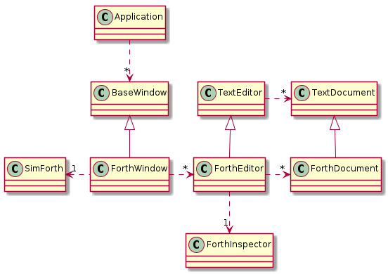

# Forth Editor IDE

The class diagram for the Forth IDE is the following. Note that the GUI is made with GTKmm version 3 (a C++ wrapper for GTK+3).

SimForth: is our Forth interpreter. One instance is enough by application.

Application: is a class allowing to create multiple independent GTK+ windows.

BaseWindow: is an facade class offering a Gnome look for derived GTK+ windows. In our case
there is only kind of derived class concerning BaseWindow: ForthWindow but in the SimTaDyn project, a second type of window also inherits from this class: a window holding widgets for a map editor.

ForthWindow: is a concrete implementation of BaseWindow. It offers a facade for
namaging multiple Forth documents, show the content of Forth dictionary, Forth stacks ...

TextEditor: is a class allowing to edit ASCII text files (save, load, find/replace words, undo ...).

ForthEditor: is a TextEditor specialized for Forth (syntaxic coloration, auto completion ...)

ForthInspector: is a class allowing to display information from the Forth interpreter (stack, dictionary ...)
